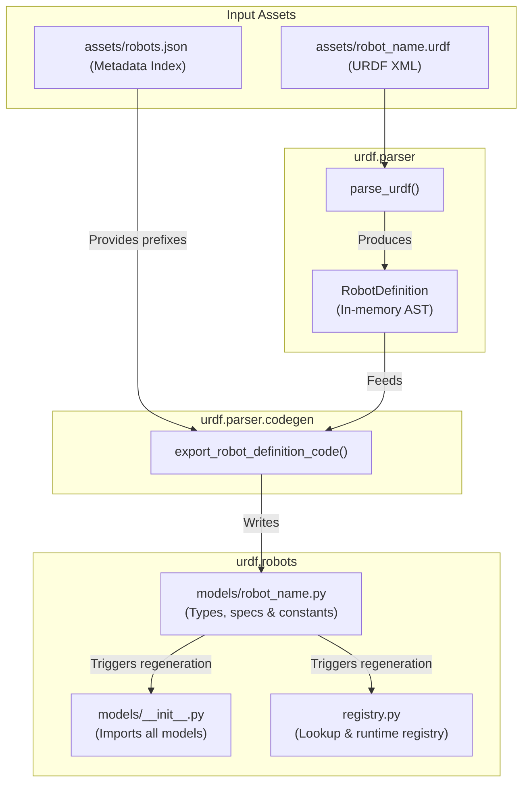
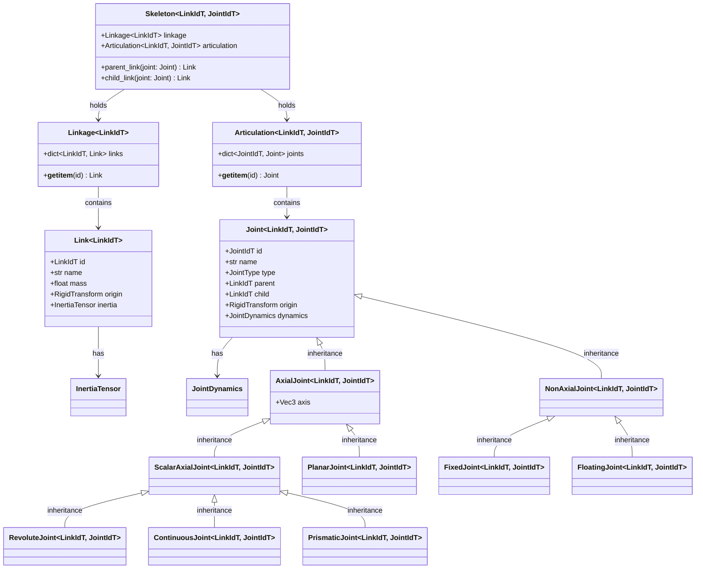

# Architecture & Design

This page explains the design philosophy, codebase structure, and data relationships in the **urdf** library.

---

## Design Philosophy

The core goal of `urdf` is to bring **compile-time type safety** to URDF parsing.

Traditionally, robotics libraries parse URDF files at runtime into generic data structures. While flexible, this approach introduces several problems:
1. **No Autocomplete**: Accessing link names (e.g. `"left_shin_link"`) requires raw string lookups, providing no IDE support.
2. **Runtime Failures**: Typos in joint or link names are only caught when that specific line of code is executed.
3. **No Type Checking**: Static analyzers (like mypy or pyright) cannot verify that you are referencing valid joints or matching the right links to the right robot.

`urdf` solves this by introducing a **compilation step**. URDF XML descriptions are parsed and exported into static Python modules containing strongly-typed `StrEnum` identifiers and static layout specifications.

---

## The Compilation Pipeline

Below is a flow diagram showing how a URDF XML file is converted into typed Python assets:

### Key Steps:
1. **XML Parsing**: `urdf.parser.parse_urdf()` parses the XML elements into a structured `RobotDefinition` dataclass, validating basic requirements (e.g., that limited joints possess a `<limit>` tag).
2. **Code Generation**: `urdf.parser.codegen` inspects the parsed definition, formats names into clean PEP-8 compliant identifiers, and renders a Python module containing:
   - A `LinkId` class representing every link.
   - A `JointId` class representing every joint.
   - Compact raw specification tuples (`_LINK_SPECS` and `_JOINT_SPECS`) to avoid storing heavy Python objects in memory.
   - Initialized `Linkage`, `Articulation`, and `Skeleton` constants.
3. **Registry Update**: Regenerating registry files updates the central index, making the new model available through `get_robot()` or the `RobotId` enum.

---

## The Runtime Data Model

The runtime classes represent the kinematics and dynamics layouts of a robot. All core structures are generic and parameterized by `LinkIdT` and `JointIdT` types.

Here is the UML-style class diagram showing how these types relate:

### Structural Division: Linkage vs Articulation

To simplify calculations, the physical properties are split into two collections:
* **`Linkage`**: Concerns only the **mass and shape properties** of the robot. It is a collection of rigid bodies (`Link`s) that does not concern itself with how they move.
* **`Articulation`**: Concerns only the **moveability and constraints** of the robot. It is a collection of joints (`Joint`s) that defines the limits, axes, and connectivity between parent and child link identifiers.

By combining a `Linkage` and an `Articulation`, a `Skeleton` forms a complete kinematic chain.
